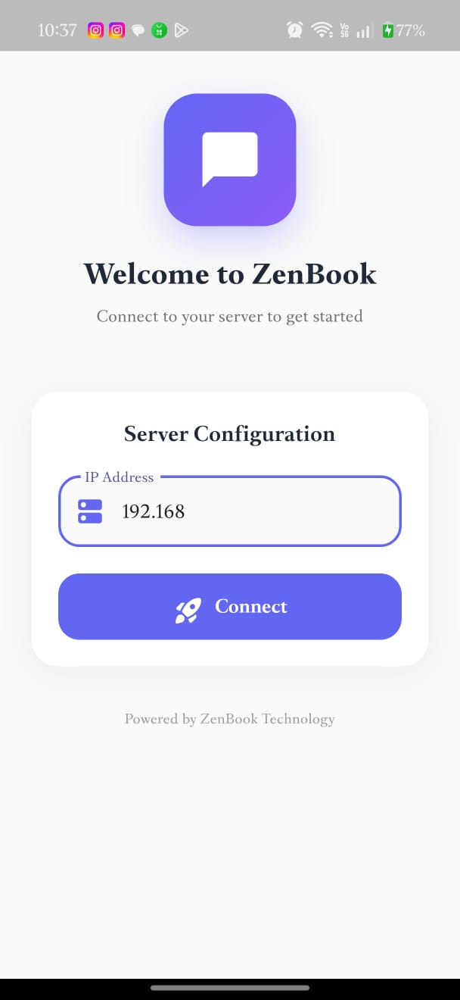
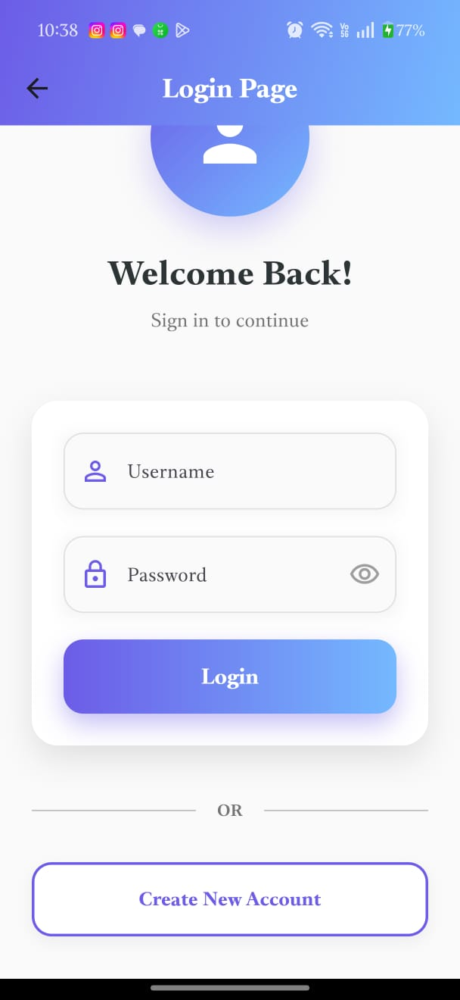
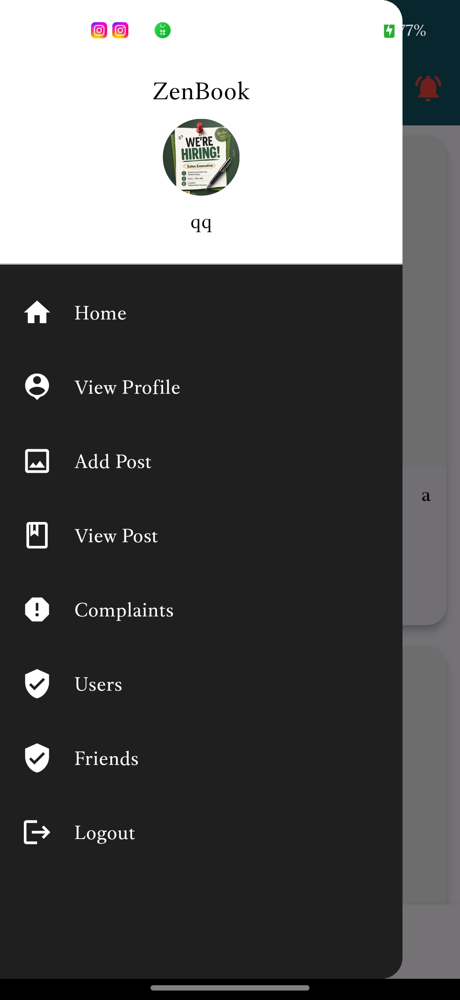
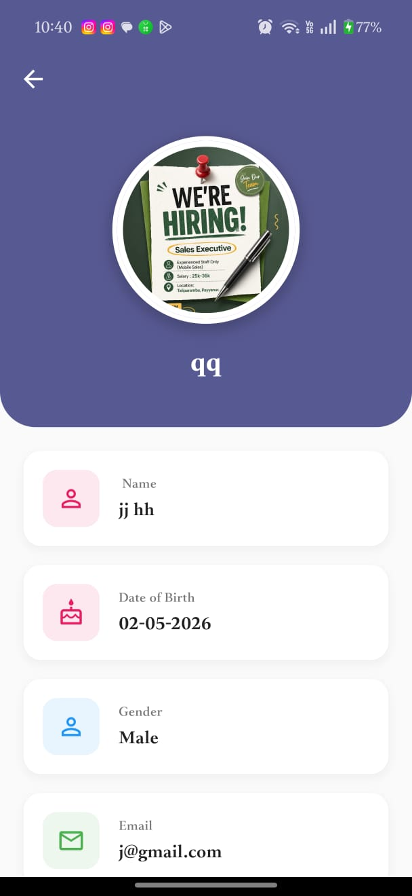
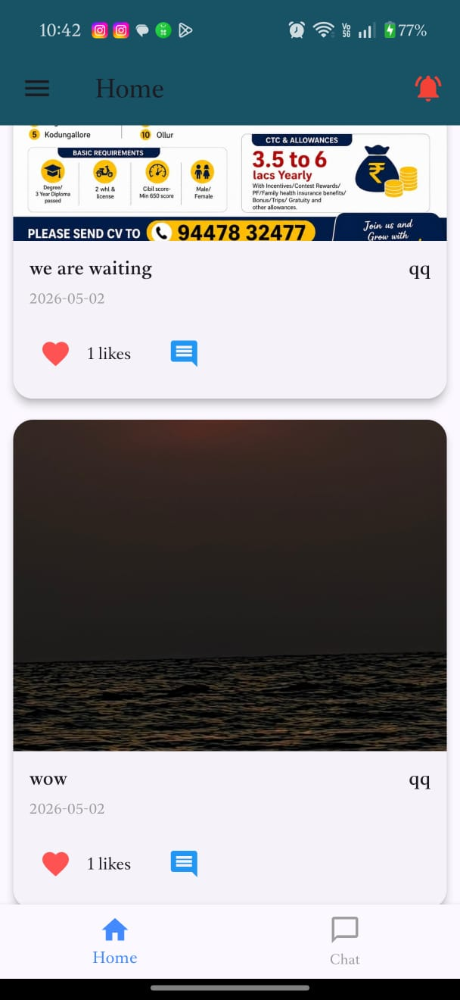
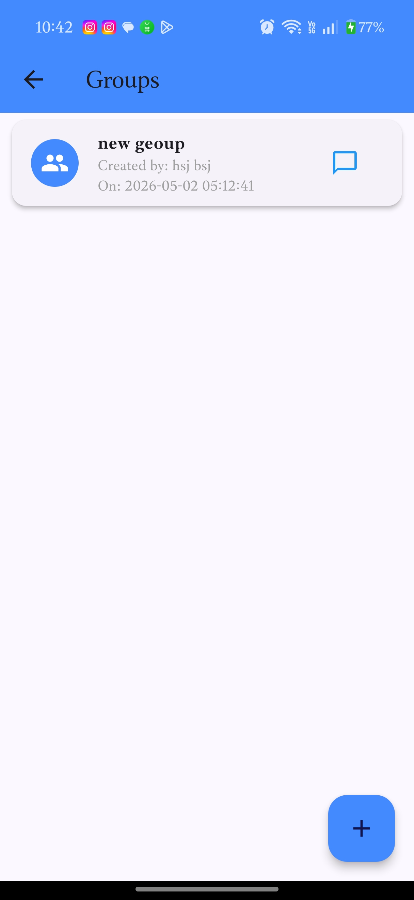
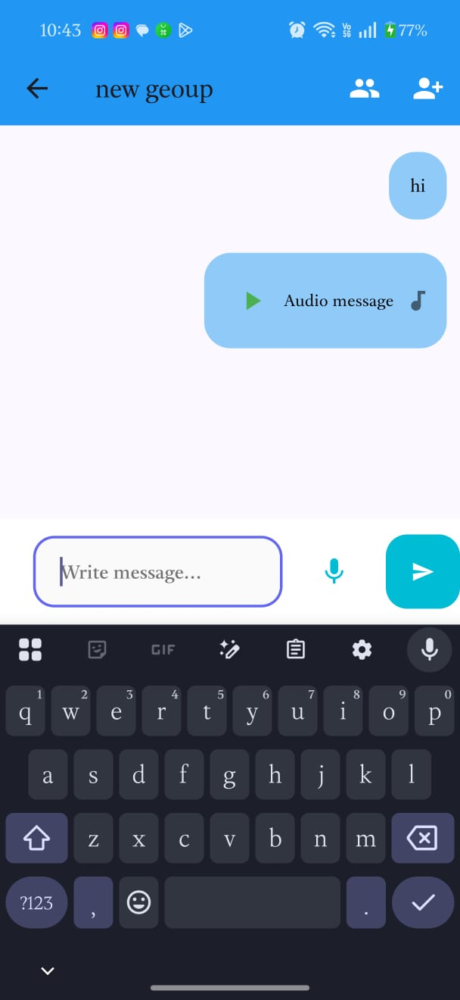
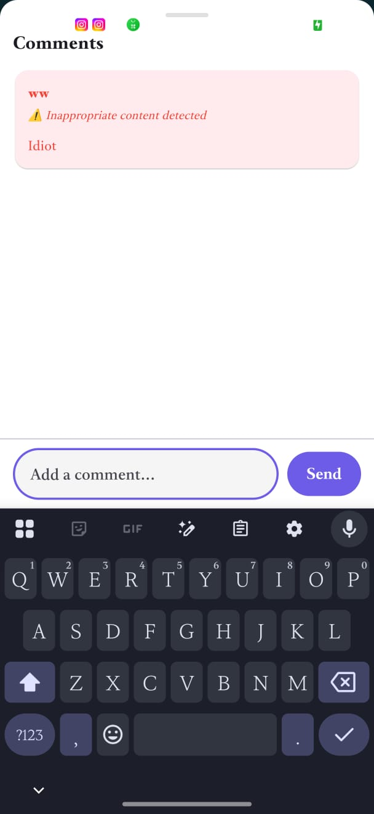

 
# 📱 ZenBook — Social Media Android App

ZenBook Android is a Flutter-based mobile application connected to the ZenBook Django backend. It provides a full social media experience with AI-powered content moderation.

---

## 📸 Screenshots

### 🚀 Server Configuration


### 🔐 Login Page


### 📋 Sidebar Menu


### 👤 Profile Page


### 🏠 Home Feed


### 👥 Groups List


### 💬 Group Chat


### 🤖 AI Comment Detection


---

## 🚀 Features

- 🚀 Server IP Configuration to connect to Django backend
- 👤 User Registration & Login
- 📝 Create & View Posts (Text & Image)
- 💬 Comments with AI Toxic Detection
- 👍 Like Posts
- 👫 Friends System
- 💌 Private Chat
- 👥 Group Chat with Audio Messages
- 🔔 Notifications
- 👤 View & Edit Profile
- 🤖 AI Warning shown on toxic comments

---

## 🛠️ Tech Stack

| Layer | Technology |
|-------|-----------|
| Framework | Flutter |
| Language | Dart |
| Backend | Django REST API |
| Platform | Android |

---

## ⚙️ How to Run Locally

### Prerequisites
- Flutter SDK
- Android Studio
- Django backend running locally

### Steps

**1. Clone the repository**
```bash
git clone https://github.com/justin-0/zenbook-android.git
cd zenbook-android
```

**2. Install dependencies**
```bash
flutter pub get
```

**3. Run the app**
```bash
flutter run
```

**4. Enter server IP**

When app opens → enter your local IP address (e.g. `192.168.1.x`) to connect to Django backend

---

## 🌐 Backend Repository

The Django web backend repository is available here:
👉 [zenbook-web](https://github.com/justin-0/zenbook-web)

---

## 👨‍💻 Developer

**Justin**
- 🎓 BCA Graduate
- 💼 1 Year Experience as Junior Software Developer

---

## 📄 License

This project is for educational purposes.